# Enterprise Observability & DevSecOps Platform

**Secure · Automated · Monitored · Cloud Native**

A capstone project addressing a common production gap: a Kubernetes environment with no centralized monitoring, no security scanning, and no alerting. This repository implements an integrated observability and DevSecOps platform that continuously monitors applications and infrastructure while enforcing security at every stage of the CI/CD pipeline.

A lightweight Nginx application serves as the deployment target, demonstrating the full workflow end-to-end — from code checkout to a monitored, security-scanned, running Kubernetes workload.

## Table of Contents

- [Core Objective](#core-objective)
- [Tech Stack](#tech-stack)
- [Repository Structure](#repository-structure)
- [CI/CD Pipeline](#cicd-pipeline-jenkins)
- [Application Image](#application-image)
- [Kubernetes Deployment](#kubernetes-deployment)
- [Monitoring & Dashboards](#monitoring--dashboards)
- [Alerting Rules](#alerting-rules)
- [Security Integration](#security-integration-devsecops)
- [Prerequisites](#prerequisites)
- [Deliverables](#deliverables)
- [Screenshots](#screenshots)
- [License](#license)

---

## Core Objective

Build a centralized monitoring and DevSecOps platform that:

- Continuously monitors applications, infrastructure, and code quality
- Enforces security throughout the CI/CD pipeline (secrets, code quality, container vulnerabilities)
- Deploys to Kubernetes with automated rollout verification
- Alerts proactively on infrastructure and application issues

## Tech Stack

| Category | Tools |
|---|---|
| CI/CD | Jenkins |
| Containerization | Docker |
| Orchestration | Kubernetes |
| Code Quality | SonarQube + Quality Gates |
| Secret Detection | Gitleaks |
| Container Scanning | Trivy |
| Monitoring | Prometheus, Node Exporter, kube-state-metrics |
| Visualization | Grafana |
| Package Management | Helm |

## Repository Structure

```
.
├── Jenkinsfile                          # CI/CD pipeline definition
├── Dockerfile                           # Nginx-based application image
├── sonar-project.properties             # SonarQube project configuration
├── application/                         # Static app served by Nginx
│   ├── index.html
│   ├── style.css
│   └── default.conf                     # Nginx server configuration
├── k8s/
│   ├── deployment.yaml                  # Kubernetes Deployment (capstone-nginx-app)
│   └── service.yaml                     # NodePort Service (port 30080)
├── monitoring/
│   ├── prometheus/
│   │   └── prometheus-values.yaml       # Prometheus Helm values + alert rules
│   └── grafana/
│       └── grafana-values.yaml          # Grafana Helm values + datasource/dashboards
├── scripts/
│   ├── install-monitoring-stack.sh      # Installs Prometheus + Grafana via Helm
│   └── stress-test.sh                   # Triggers a CPU load test to validate alerts
└── Screenshots/                         # Reference screenshots referenced in this README
```

## CI/CD Pipeline (Jenkins)

The `Jenkinsfile` defines an end-to-end DevSecOps pipeline:

| Stage | Description |
|---|---|
| 1. Checkout | Pulls source code from SCM |
| 2. Secret Detection (Gitleaks) | Fails the build if secrets are found in the codebase |
| 3. SonarQube Analysis | Static code analysis using the configured `SonarScanner` |
| 4. SonarQube Quality Gate | Aborts the pipeline if the quality gate isn't met (3-minute timeout) |
| 5. Docker Build | Builds the image, tagged with the Jenkins `BUILD_NUMBER` |
| 6. Image Scan (Trivy) | Scans the image for `HIGH`/`CRITICAL` vulnerabilities; fails on detection |
| 7. Push to Docker Hub | Tags and pushes both `:BUILD_NUMBER` and `:latest` |
| 8. Deploy Monitoring Stack | Runs `install-monitoring-stack.sh` to (re)deploy Prometheus/Grafana |
| 9. Deploy to Kubernetes | Applies manifests in `k8s/` and updates the deployment image |
| 10. Rollout Verification | Confirms a healthy rollout via `kubectl rollout status` |

**Required Jenkins credentials:**

| Credential ID | Type | Used for |
|---|---|---|
| `sonar-token` | Secret text | SonarQube authentication |
| `dockerhub-creds` | Username / Password | Docker Hub login |
| `kubeconfig` | Secret file | Cluster access for deploy & monitoring stages |

## Application Image

The application is served by a minimal, hardened Nginx container:

```dockerfile
FROM nginx:alpine

RUN rm -rf /usr/share/nginx/html/*

COPY application/ /usr/share/nginx/html/
COPY application/default.conf /etc/nginx/conf.d/default.conf

EXPOSE 80

CMD ["nginx", "-g", "daemon off;"]
```

**Build and run locally:**

```bash
docker build -t nginx-capstone .
docker run -p 8080:80 nginx-capstone
```

The app is then available at `http://localhost:8080`.

## Kubernetes Deployment

| Resource | Details |
|---|---|
| Deployment | `capstone-nginx-app` · 2 replicas · requests: 100m CPU / 128Mi memory · limits: 250m CPU / 256Mi memory |
| Service | `capstone-nginx-service` · type `NodePort` · exposed on `nodePort: 30080` |

**Deploy manually:**

```bash
kubectl apply -f k8s/
kubectl get pods,svc
```

Access the application at `http://<node-ip>:30080`.

## Monitoring & Dashboards

Prometheus and Grafana are installed via Helm using `scripts/install-monitoring-stack.sh`, which:

1. Adds the `prometheus-community` and `grafana` Helm repositories
2. Creates the `monitoring` namespace
3. Installs/upgrades Prometheus using `monitoring/prometheus/prometheus-values.yaml`
4. Installs/upgrades Grafana using `monitoring/grafana/grafana-values.yaml`

```bash
chmod +x scripts/install-monitoring-stack.sh
./scripts/install-monitoring-stack.sh
```

Grafana is pre-configured with:

- **Prometheus** as the default datasource (`http://prometheus-server.monitoring.svc.cluster.local`)
- A default dashboard provider that auto-loads community dashboard **#315 (Kubernetes Cluster Monitoring)**

Dashboards cover CPU usage, memory usage, disk utilization, network traffic, pod health, node health, deployment status, and namespace utilization.

> **Note:** `grafana-values.yaml` currently sets `adminPassword: "admin"`. Replace this with a securely managed secret before deploying to any shared or production environment.

## Alerting Rules

Configured in `prometheus-values.yaml` under `serverFiles.alerts`:

| Alert | Condition | Severity |
|---|---|---|
| `HighCPUUsage` | CPU usage above 85% for 5 minutes | Warning |
| `PodCrashLoopBackOff` | Pod restarts detected over a 5-minute window | Critical |
| `NodeNotReady` | Node reports not-ready status for 5 minutes | Critical |

**Testing alerts:**

```bash
chmod +x scripts/stress-test.sh
./scripts/stress-test.sh
```

This deploys a temporary pod running `polinux/stress` at 4 CPUs for 10 minutes. Check Grafana, Prometheus, or Alertmanager to confirm the alert fires.

## Security Integration (DevSecOps)

| Stage | Tool | Purpose |
|---|---|---|
| Secret Detection | Gitleaks | Blocks commits/builds containing hardcoded secrets |
| Static Code Analysis | SonarQube | Enforces code quality via Quality Gates |
| Container Scanning | Trivy | Blocks images with HIGH/CRITICAL CVEs from being pushed |

`sonar-project.properties`:

```properties
sonar.projectKey=nginx-capstone-app
sonar.projectName=Nginx Capstone App
sonar.sources=application
sonar.sourceEncoding=UTF-8
```

## Prerequisites

- Kubernetes cluster with `kubectl` access
- Helm 3
- Jenkins with the Docker, Kubernetes CLI, and SonarQube Scanner plugins installed
- A running SonarQube server instance
- Trivy and Gitleaks installed on the Jenkins agent
- A Docker Hub account (or another container registry)

## Deliverables

- Prometheus configuration and alert rules
- Grafana dashboards
- Jenkins CI/CD pipeline
- SonarQube integration with Quality Gates
- Monitoring and security documentation (this README)

## Screenshots

### Infrastructure Setup

| EC2 Instance | Kubernetes Nodes |
|:---:|:---:|
| 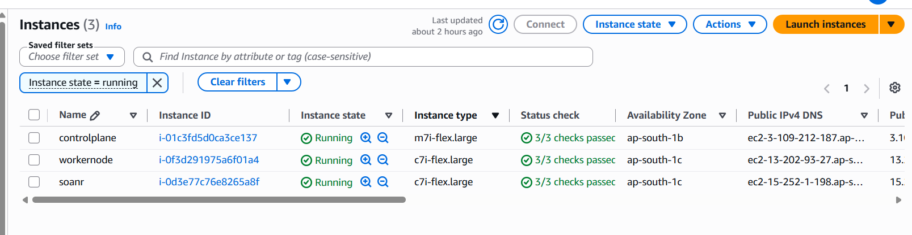 | 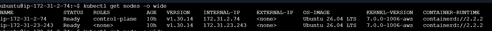 |
| *EC2 Instance* | *Kubernetes control plane and worker nodes* |

### CI/CD Pipeline

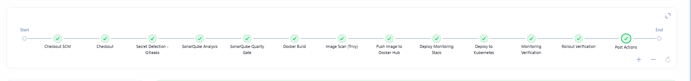
*Jenkins pipeline execution*

### Security Scanning

| Gitleaks | SonarQube |
|:---:|:---:|
| 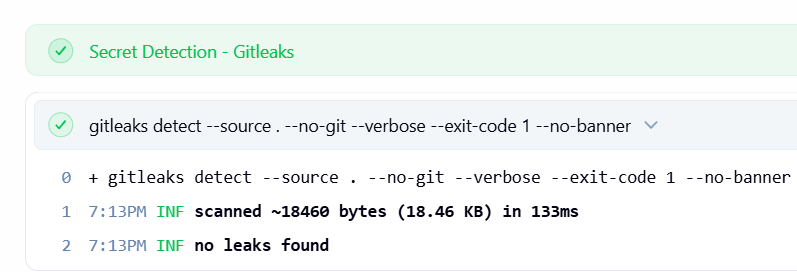 | 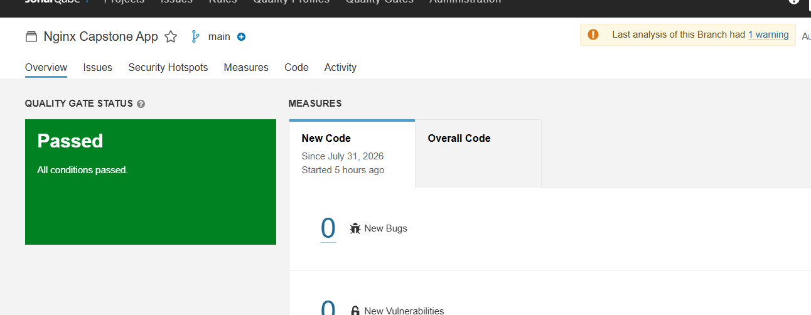 |
| *Gitleaks secret scan* | *SonarQube analysis* |

| SonarQube Quality Gate | Trivy |
|:---:|:---:|
| 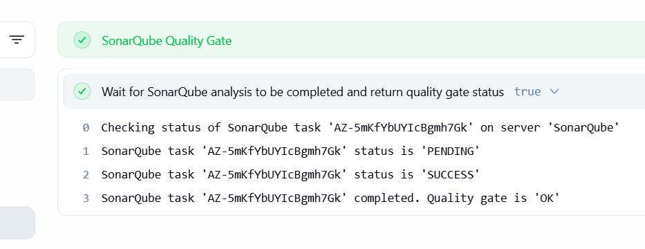 | 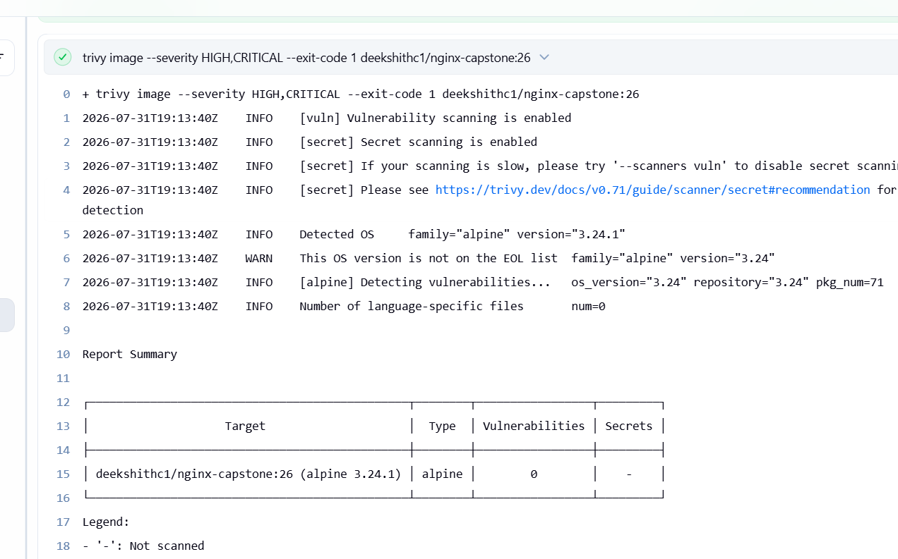 |
| *SonarQube Quality Gate result* | *Trivy vulnerability scan* |

### Container Registry & Kubernetes Deployment

| Docker Hub | Kubernetes |
|:---:|:---:|
| 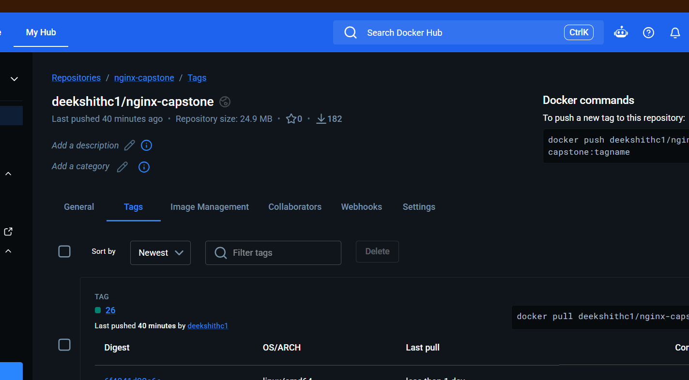 | 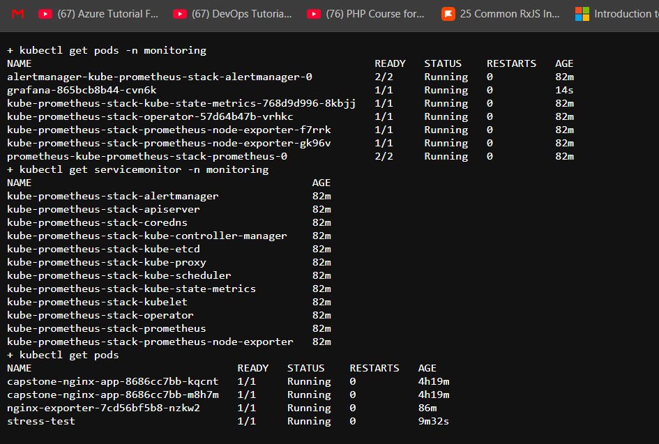 |
| *Docker Hub repository* | *Kubernetes deployment* |

### Monitoring with Prometheus


*Prometheus dashboard*

| Firing Alerts | Alertmanager |
|:---:|:---:|
| 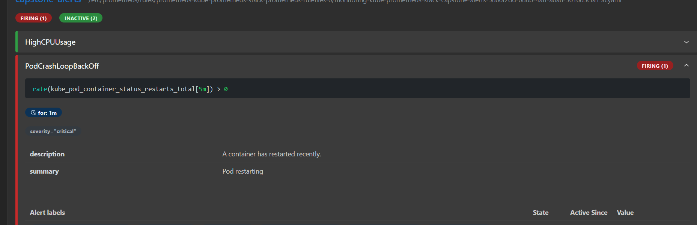 | 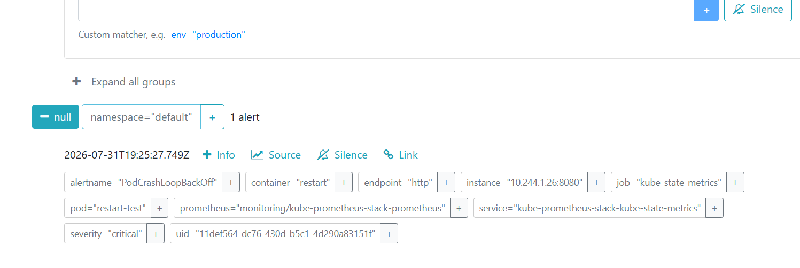 |
| *Prometheus firing alerts* | *Alertmanager* |

### Grafana Monitoring Dashboards

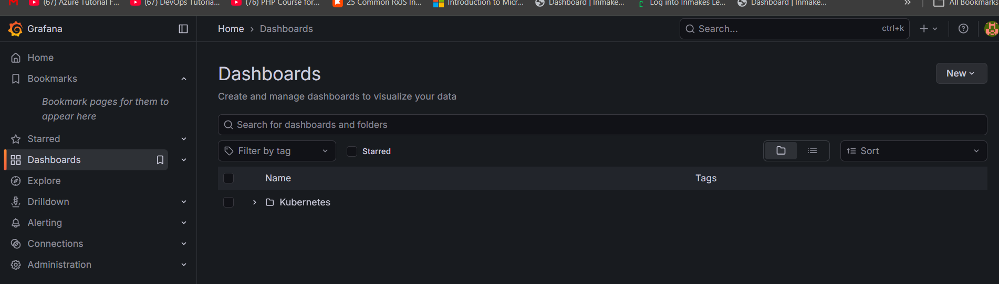
*Grafana overview dashboard*

| Application CPU | Application Memory |
|:---:|:---:|
| 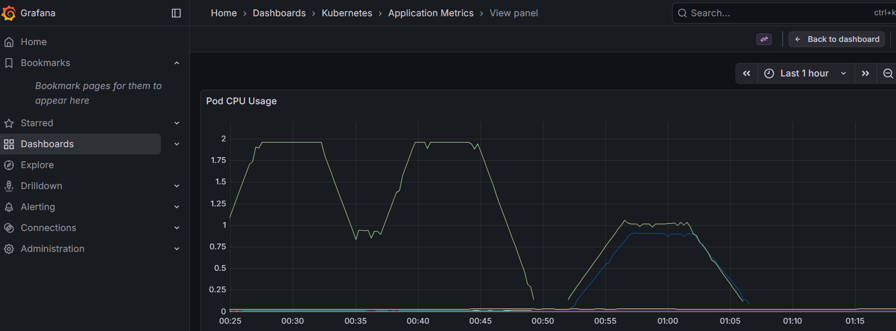 | 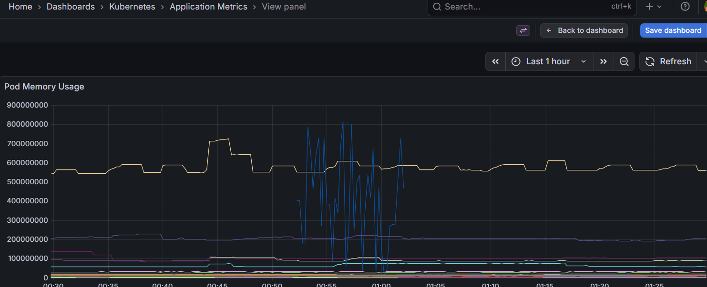 |
| *Application CPU usage* | *Application memory usage* |

| Application Restarts | Application Status |
|:---:|:---:|
| 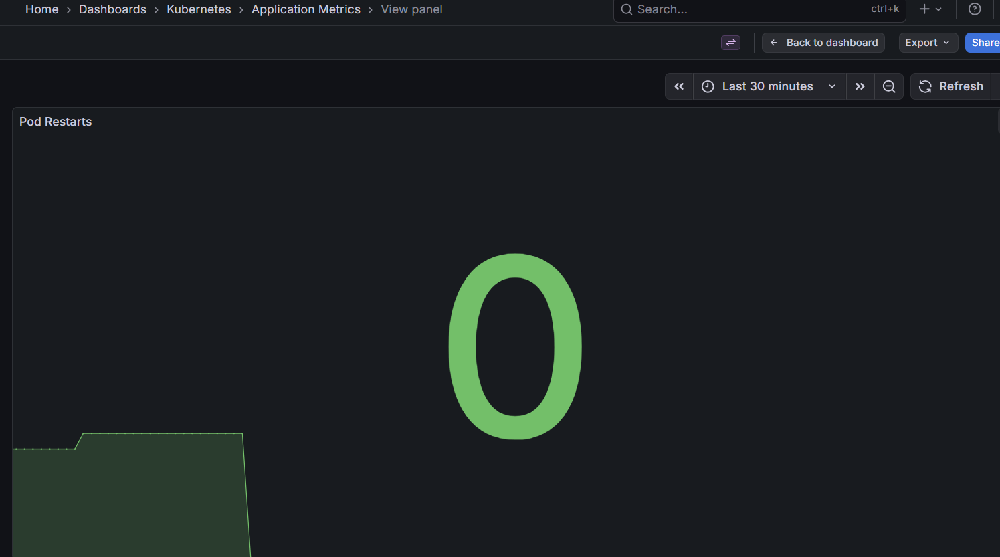 | 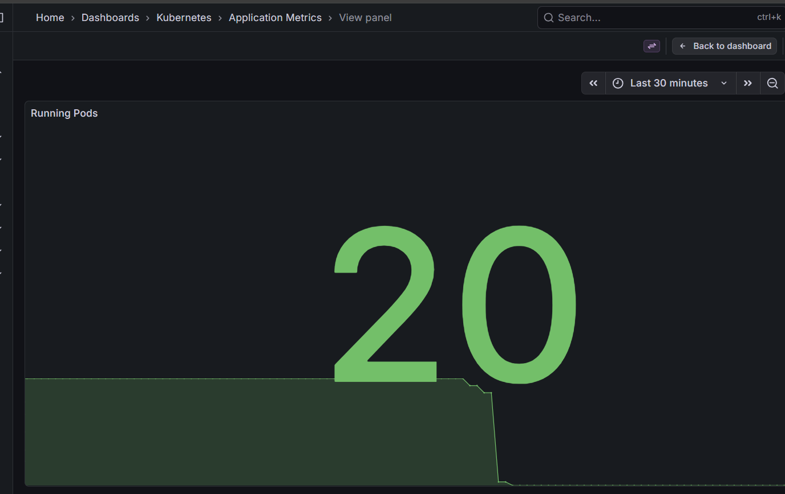 |
| *Application restart count* | *Application running status* |

| Cluster CPU | Cluster Memory |
|:---:|:---:|
| 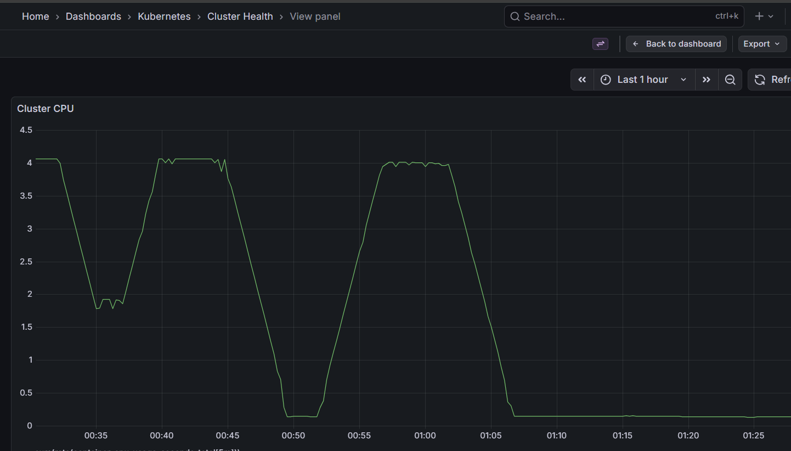 | 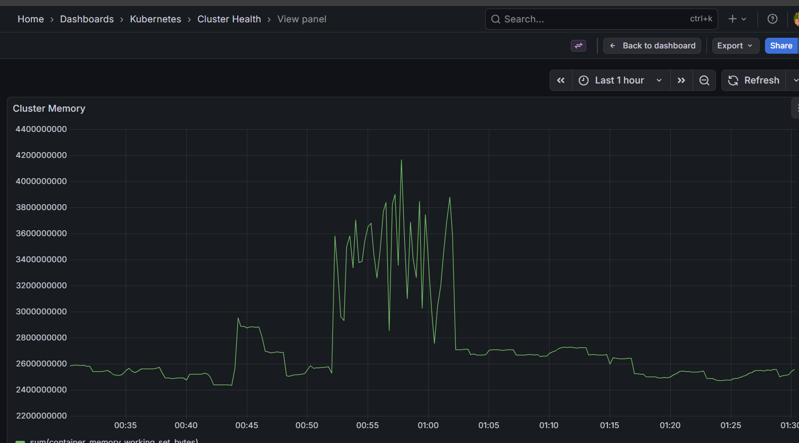 |
| *Cluster CPU usage* | *Cluster memory usage* |
